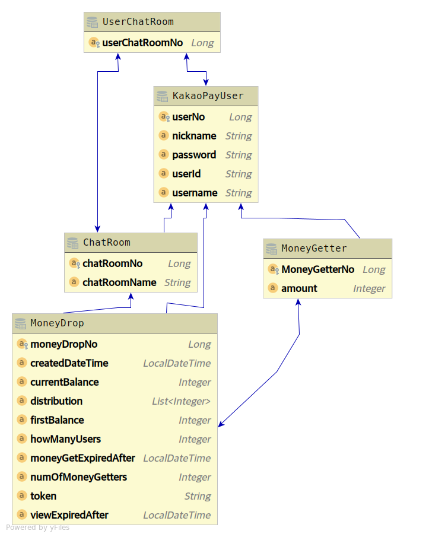

# 돈 뿌리기, 받기, 조회 API 구현하기

### GitHub URL
https://github.com/inherithandle/gyutaechoi2020

### 프로젝트 빌드, 실행을 위해 반드시 설치되어 있어야 합니다.
* Java 8 혹은 그 이후 버전

### 사용한 라이브러리, 프레임워크
* Spring Boot 2.3.6 RELEASE
* Spring Framework 5.2.11.RELEASE
* Spring Data JPA 2.3.6 RELEASE
* JPA 2.2, Hibernate 5.4.23.Final
* H2 Database 1.4.197
* Gradle Wrapper 6.6.1 (빌드, 실행)
* Java 8

### 빌드, 실행
프로젝트안에 포함되어있는 Gradle Wrapper를 사용하여 빌드, 실행 해주세요.
```bash
git clone https://github.com/inherithandle/gyutaechoi2020
cd gyutaechoi2020
./gradlew bootRun
```
* API 문서: [http://localhost:8080/swagger-ui.html](http://localhost:8080/swagger-ui.html)
* DB 테이블을 직접 확인하고 싶으시면 [http://localhost:8080/h2-console](http://localhost:8080/h2-console) 을 확인하시면 됩니다.
    * 웹 콘솔 로그인 할때 아래와같이 입력해주세요.
    * Driver Class: org.h2.Driver
    * JDBC URL: jdbc:h2:mem:testdb
    * id: sa
    * password: password

### 문제해결 전략, 데이터베이스 설계
* H2 database, JPA를 사용했습니다.
* JPA `@Entity` 클래스들을 이용하여 테이블을 자동생성합니다.
* kakao_pay_user 테이블 (KakaoPayUser.java)
    * 유저의 정보를 담고 있습니다.
    * X-USER-ID 헤더 값으로 user_no 칼럼을 사용합니다. 
* chat_room 테이블 (ChatRoom.java)
    * 채팅방 정보를 담고 있습니다.
    * X-ROOM-ID 헤더 값으로 chat_room_name 칼럼을 사용합니다.
        * chat_room_name은 테이블 전체에서 유니크하도록 테이블 설정 했습니다.
        * 한글을 사용할 수 없습니다. HTTP 헤더 값은 ASCII 인코딩값만 사용하는 것이 표준입니다.
        * 그래도 한글을 쓰고 싶다면 URL encoding 하셔서 API를 호출해야 합니다. 
* user_chat_room 테이블 (UserChatRoom.java)
    * 어떤 유저가 어떤 채팅방에 참여하고 있는지를 알 수 있는 다대다 매핑 테이블입니다.
* money_drop 테이블: (MoneyDrop.java)
    * "돈뿌리기"에 대한 정보를 담고 있습니다. 어떤 유저가 돈을 뿌리는지, 뿌릴 인원, 뿌릴 금액을 담고 있습니다.
* money_getter 테이블: (MoneyGetter.java)
    * money_drop 테이블의 외래키(money_drop_no)를 가지고 있고, money_drop과 1:N 관계입니다.
    * 누가 돈을 주웠는지, 얼마나 주웠는지 알 수 있습니다.




### API를 호출해서 정상 동작했을 때 아래와 같은 일이 발생합니다.
* 뿌리기 API: money_drop 테이블에 돈을 뿌린 사람과(외래키), 돈을 뿌릴 금액, 뿌릴 인원, 조회 유효기간, 돈받기 유효기간을 저장합니다.
* 받기 API: money_getter 테이블에 받은 사람(외래키)과 받은 금액을 저장합니다.
* 조회 API: money_drop, money_getter, kakao_pay_user를 join하여 쿼리를 호출합니다. 돈 뿌리기 정보와, 뿌린 돈을 받은 사람의 정보를 얻습니다.
* API 호출시 필요한 인자, 자세한 예외처리 사항은 Swagger 문서에 명시해두었습니다. [http://localhost:8080/swagger-ui.html](http://localhost:8080/swagger-ui.html)
* Swagger 대신 curl을 사용하고 싶다면 아래에서 curl 명령을 복사 붙여넣기해서 API를 호출 해주세요.

### 분배 로직
* 돈 뿌리기 API 호출시, 랜덤 정수 리스트를 생성합니다. money_drop 테이블에 저장할 때, distribution(varchar) 칼럼에 콤마 구분 숫자들로 저장합니다.
* 첫번째로 돈을 받을 유저는 distribution 칼럼의 첫번째 숫자 금액, 두번째로 돈을 받을 유저는 distribution 칼럼의 두번째 숫자 금액을 받습니다.
* 돈 받는 인원이 20명 이하일 때, 돈을 모든 사람에게 1원 이상 분배합니다.
    * 10원을 9명에게 분배할 때, [1, 1, 1, 2, 1, 1, 1, 1, 1]처럼 모든 돈이 모든 사람에게 분배됩니다.
    * 누군가가 0원을 받는일은 없습니다.
    * 이 동작들을 테스트 했습니다. `DistributeMoneyAllUsersServiceTest.java`
* 돈 받는 인원이 21명 이상일 때, 돈이 모든 사람에게 분배되지 않을 수 있습니다.
    * 누군가는 0원을 받을 수 있습니다.
    * 20억을 1500명에게 모든 사람에게 1원 이상 분배한다면, distribution 칼럼이 너무 길어집니다. 길어지는 것을 막아줍니다.
    * 21명에게 500원을 뿌릴 때, 랜덤 정수 리스트 [100, 0, 200, 195, 1, 1, 1, 1, 1, 0]이 생성되어 10번째 이후 유저들은 0원을 받을 수 있습니다.
    * 이 동작을 테스트 했습니다. `DistributeMoneyNotAllUsersServiceTest.java`
* 돈뿌리기 서비스 구현체와, 돈분배 서비스의 느슨한 연결으로 분배로직을 쉽게 변경할 수 있습니다.
    * 예) 20명 대신, 돈 받는 이원 50명이하 일때 모든 사람에게 1원 이상 분배 가능 

### 초기 데이터 설정
src/main/resource/data.sql를 이용하여 초기 데이터(유저정보, 채팅방정보)를 자동 생성합니다.  
**유저 데이터 설정**  
아래와 같이 유저가 이미 존재한다고 가정합니다. Spring Boot App을 실행하면 자동으로 kakao_pay_user table에 채워줍니다.  
X-USER-ID 헤더에 사용되는 값은 user_no 입니다.

| user_no | nickname     | user_id | password | username           |
|---------|--------------|---------|----------|--------------------|
| 1       | 원더코딩우먼 | user1   | 12345    | Ada Lovelace       |
| 2       | 윈도우맨     | user2   | 12345    | Bill Gates         |
| 3       | 테슬라맨     | user3   | 12345    | Elon Musk          |
| 4       | 제로투원맨   | user4   | 12345    | Peter Thiel        |
| 5       | 이더리움맨   | user5   | 12345    | Vitalik Buterin    |
| 6       | 비트코인맨   | user6   | 12345    | Satoshi Nakamoto   |
| 7       | 루비맨       | user7   | 12345    | Yukihiro Matsumoto |
| 8       | 파이썬맨     | user8   | 12345    | Guido van Rossum   |
| 9       | 구글맨       | user9   | 12345    | Jeffrey Dean       |
| 10      | 검색왕       | user10  | 12345    | Larry Page         |

**채팅방 설정**

| chat_room_no | chat_room_name | creator_user_no |
|--------------|----------------|-----------------|
| 1            | chatroom_id1   | 1               |
| 2            | chatroom_id2   | 1               |
| 3            | chatroom_id3   | 8               |
* X-ROOM-ID 헤더 값으로 chat_room 테이블의 chat_room_name을 사용합니다.
* 채팅방 번호 1, 채팅방(chatroom_id1)에는 모든 유저 10명이 참여하고 있습니다.
* 채팅방 번호 2, 채팅방(chatroom_id2)에는 러브레이스(1), 일론 머스크(3), 래리 페이지(10)가 대화하고 있습니다.
* 채팅방 번호 3, 채팅방(chatroom_id3)에는 귀도 반 로썸(8), 피터 틸(4), 에이다 러브레이스(1)가 대화하고 있습니다.
* 초기화 데이터에 대해 자세히 알고 싶다면, src/main/resource/data.sql 에서 확인 가능합니다.

### 기능, 제약사항 유닛 테스트
**뿌리기 조회 API 유닛 테스트, MoneyDropServiceGetMoneyDropUnitTest.java**
* 길이가 3자리가 아닌 토큰이 들어오면 예외를 던집니다.
* 토큰 정보를 찾을 수 없다면 예외를 던집니다.
* 돈뿌린 사람만 "돈뿌리기" 정보를 조회할 수 있습니다.
* 조회 유효기간이 지난 경우 예외를 던집니다.
* 조회 성공시, 올바르게 응답 값을 조회할수 있는지 확인합니다.
```bash
./gradlew :cleanTest :test --tests "com.gyutaechoi.kakaopay.service.MoneyDropServiceGetMoneyDropUnitTest" 
```
**돈 뿌리기 API 유닛 테스트 MoneyDropServiceAddMoneyDropUnitTest.java**
* 유저가 참여하고 있지 않은 채팅방에 돈을 뿌리려고 하면 예외를 던집니다.
* 유저가 너무 많은 인원에게 돈뿌리기를 시도하면 예외를 던집니다.
    * 채팅방 인원이 10명이면 9명(본인제외)까지 지정할 수 있습니다.
    * 채팅방 인원이 10명이고, 500원을 15명에 뿌리려고 시도하면 예외를 던집니다.
* 돈 뿌리기 API가 정상호출되면, 3자리 토큰값을 리턴합니다.
```bash
./gradlew :cleanTest :test --tests "com.gyutaechoi.kakaopay.service.MoneyDropServiceAddMoneyDropUnitTest"
```
**돈 뿌리기 요청 모델 유닛 테스트 MoneyDropControllerTest.java**
* 뿌릴 금액, 뿌릴 인원이 양수 인지 확인 합니다. `@Positive`
* Custom Validator를 사용하여 뿌릴 금액이 뿌릴 인원 보다 큰 값인지 확인합니다. (MoneyShouldBeGreaterThanUsers.java)
    * 돈받기 인원이 5명인데 4원을 뿌리면 400 응답을 리턴합니다.
```bash
./gradlew :cleanTest :test --tests "com.gyutaechoi.kakaopay.controller.MoneyDropControllerTest"
```

**돈 받기 API 유닛 테스트 MoneyDropServiceTryToGetMoneyUnitTest.java**
* 유저가 참여하고 있지 않은 채팅방에 있는 뿌린돈을 받으려고 시도하면 예외를 던집니다.
* 길이가 3이 아닌 토큰에 대해 예외를 던집니다.
* 돈뿌리기 토큰 정보를 발견하지 못하면 예외를 던집니다.
* 돈을 뿌린 유저는 자신의 돈 받기 시도할 수 없습니다. 그런 시도를 하면 예외를 던집니다.
* 유효기간이 지난후에 돈 받기 API를 호출하면 돈을 받을 수 없습니다.
* 이미 돈받기 API를 호출한 유저는 돈을 받을 수 없습니다.
* 이미 모든 유저가 돈을 주웠다면, 돈을 받을 수 없습니다.
```bash
./gradlew :cleanTest :test --tests "com.gyutaechoi.kakaopay.service.MoneyDropServiceTryToGetMoneyUnitTest"
```
**분배 로직 유닛 테스트**
* DistributeMoneyAllUsersService, DistributeMoneyNotAllUsersService 클래스를 테스트합니다.
* 분배된 돈의 합이 뿌릴 돈과 같은지 확인합니다.
    * 어떠한 경우에도 분배된 돈의 합이 뿌린 돈보다 크지 않음을 확인합니다.
* 극단적인 값을 테스트 합니다.
    * 뿌릴 금액 10원, 받는 인원 9명일 때 제대로 동작하는지 테스트합니다.
        * 1명만 2원을 받고, 8명이 1원을 받았는지 체크합니다.
    * 뿌릴 금액 20억, 받는 인원 1500명이여도 제대로 동작하는지 체크 합니다.
```bash
./gradlew :cleanTest :test --tests "com.gyutaechoi.kakaopay.service.DistributeMoneyAllUsersServiceTest"
./gradlew :cleanTest :test --tests "com.gyutaechoi.kakaopay.service.DistributeMoneyNotAllUsersServiceTest"
```

### 그 외 유닛, 통합테스트
* @Repository 객체들이 제가 원하는대로 쿼리를 생성했는지 확인했습니다. (*RepositoryTest.java)
* MoneyDropService 객체에, Repository 객체들이 잘 주입되어 DB와 연동되는지 확인했습니다. (MoneyDropServiceTest.java)
* 난수가 범위에 맞게 잘 생성되는지 확인합니다.
* 그 외 35개 이상의 테스트 케이스

### API 사용 시나리오 1 
뿌리기 API를 호출하여 토큰 정보를 얻습니다.
* moneyToDrop: 뿌릴 금액
* howManyUsers: 돈을 받을 수 있는 최대 인원
* 뿌릴 금액을 인원수에 맞게 분배하여 money_drop table의 distribution 칼럼에 저장합니다.
* 고유 token을 리턴해줍니다.  
* 유저번호 1인 Ada Lovelace가 돈을 채팅방(chatroom_id1)에 500원을 3명에 뿌립니다.
```bash
curl -X POST --data '{"moneyToDrop":500,"howManyUsers":3}' -H 'X-ROOM-ID: chatroom_id1' -H 'X-USER-ID: 1' -H 'Content-Type: application/json' http://localhost:8080/money-drop

{
  "token" : "0nR"
}
```
유저번호 1인 Ada Lovelace가 자신의 토큰으로 받기 API를 호출해봅니다. 뿌리기 API로 리턴받은 토큰으로 curl 시도해주세요. 자신이 뿌린돈을 받을 수 없기 때문에 400 응답을 얻습니다.
```bash
curl -X POST --data '{"token":"0nR"}' -H 'X-ROOM-ID: chatroom_id1' -H 'X-USER-ID: 1' -H 'Content-Type: application/json' http://localhost:8080/money-getter

{
  "timestamp" : "2020-11-20T15:42:35.127",
  "status" : 400,
  "message" : "돈을 뿌린 사람은 받을 수 없습니다!"
}
```

유저번호 3인 Elon Musk가 받기 API 호출하여 돈을 받습니다. 리턴 값으로 받은 돈을 알 수 있습니다. 뿌리기 API로 리턴받은 토큰으로 curl 시도해주세요. 
```bash
curl -X POST --data '{"token":"0nR"}' -H 'X-ROOM-ID: chatroom_id1' -H 'X-USER-ID: 3' -H 'Content-Type: application/json' http://localhost:8080/money-getter

{
  "receivedMoney" : 269
}
```
유저번호 3인 Elon Musk가 다시 한번 받기 API 호출해봅니다. 이미 돈을 받았기 때문에 401응답을 받습니다. 뿌리기 API로 리턴받은 토큰으로 curl 시도해주세요.
```bash
curl -X POST --data '{"token":"0nR"}' -H 'X-ROOM-ID: chatroom_id1' -H 'X-USER-ID: 3' -H 'Content-Type: application/json' http://localhost:8080/money-getter

{
  "timestamp" : "2020-11-20T15:43:41.302",
  "status" : 403,
  "message" : "이미 돈을 지급 받았습니다."
}
```
유저번호 7인 Yukihiro Matsumoto가 뿌린 돈을 줍습니다. 뿌리기 API로 리턴받은 토큰으로 curl 시도해주세요.
```bash
curl -X POST --data '{"token":"0nR"}' -H 'X-ROOM-ID: chatroom_id1' -H 'X-USER-ID: 7' -H 'Content-Type: application/json' http://localhost:8080/money-getter

{
  "receivedMoney" : 170
}
```
유저번호 10인 Larry Page가 뿌린 돈을 줍습니다. 뿌리기 API로 리턴받은 토큰으로 curl 시도해주세요.
```bash
curl -X POST --data '{"token":"0nR"}' -H 'X-ROOM-ID: chatroom_id1' -H 'X-USER-ID: 10' -H 'Content-Type: application/json' http://localhost:8080/money-getter

{
  "receivedMoney" : 9
}
```
유저번호 2인 Bill Gates가 돈을 받으려고 시도했지만 이미 모든 돈이 분배되었습니다. 403 응답을 받습니다.  
반드시 위에서 리턴받은 토큰으로 curl 시도해주세요.
```bash
curl -X POST --data '{"token":"0nR"}' -H 'X-ROOM-ID: chatroom_id1' -H 'X-USER-ID: 2' -H 'Content-Type: application/json' http://localhost:8080/money-getter

{
  "timestamp" : "2020-11-20T15:44:43.987",
  "status" : 403,
  "message" : "이미 모든 인원에게 돈을 주었습니다. 다음 기회에!"
}
```
유저번호 1인 Ada Lovelace가 자신의 돈뿌리기 정보를 토큰을 이용하여 확인해봅니다. 뿌리기 API로 리턴받은 토큰으로 curl 시도해주세요.
```bash
curl -H 'X-USER-ID: 1' http://localhost:8080/money-drop?token=0nR

{
  "createdDateTime" : "2020-11-20T15:42:03.474",
  "moneyToDrop" : 500,
  "droppedMoney" : 448,
  "moneyGetters" : [ {
    "userNo" : 3,
    "nickname" : "테슬라맨",
    "username" : "Elon Musk",
    "amount" : 269
  }, {
    "userNo" : 7,
    "nickname" : "루비맨",
    "username" : "Yukihiro Matsumoto",
    "amount" : 170
  }, {
    "userNo" : 10,
    "nickname" : "검색왕",
    "username" : "Larry Page",
    "amount" : 9
  } ]
}
```
유저번호 2인 Bill Gates가 Ada Lovelace의 돈 뿌리기를 조회하려고 합니다. 403 응답을 내려줍니다.
```curl 
curl -H 'X-USER-ID: 2' http://localhost:8080/money-drop?token=0nR

{
  "timestamp" : "2020-11-20T15:47:30.274",
  "status" : 403,
  "message" : "403 Forbidden"
}
```
유저번호 1인 Ada Lovelace가 8일 뒤에 자신의 돈뿌리기 정보를 토큰을 이용하여 확인해봅니다. 유효기간이 지나 조회할 수 없습니다.
```bash
curl -H 'X-USER-ID: 1' http://localhost:8080/money-drop?token=0nR
{
  "timestamp" : "2020-11-28T10:33:22.853",
  "status" : 400,
  "message" : "유효기간이 지났습니다."
}
```
### API 사용 시나리오 2
유저번호 4인 Peter Thiel이 chatroom_id3 에 돈 10,000원을 3명에게 뿌립니다.
```bash
curl -X POST --data '{"moneyToDrop":10000,"howManyUsers":3}' -H 'X-ROOM-ID: chatroom_id1' -H 'X-USER-ID: 4' -H 'Content-Type: application/json' http://localhost:8080/money-drop

{
  "token" : "6ux"
}
```

chatroom_id3 채팅방에 참여하고 있지 않는 유저번호 2인 Bill Gates가 돈 받기 API를 호출합니다. 400 응답을 내려줍니다.
```bash
curl -X POST --data '{"token":"6ux"}' -H 'X-ROOM-ID: chatroom_id3' -H 'X-USER-ID: 2' -H 'Content-Type: application/json' http://localhost:8080/money-getter
{
  "timestamp" : "2020-11-20T16:11:36.472",
  "status" : 400,
  "message" : "유저가 존재하지 않거나 유저가 채팅방이 참여하고 있지 않습니다."
}
```

다들 열심히 일하느라 바빴는지 10분동안 아무도 돈을 받으려고 하지 않습니다. 유저번호 8인 Guido가 뒤늦게 돈받기 API를 호출하지만 유효기간이 지나서 400 응답을 받습니다.
반드시 돈뿌리기 API 호출후 리턴받은 토큰으로 curl 시도해주세요.
```bash
curl -X POST --data '{"token":"6ux"}' -H 'X-ROOM-ID: chatroom_id1' -H 'X-USER-ID: 8' -H 'Content-Type: application/json' http://localhost:8080/money-getter

{
  "timestamp" : "2020-11-20T16:30:42.589",
  "status" : 400,
  "message" : "유효기간이 지났습니다."
}
```
# 긴글 읽어주셔서 감사합니다.